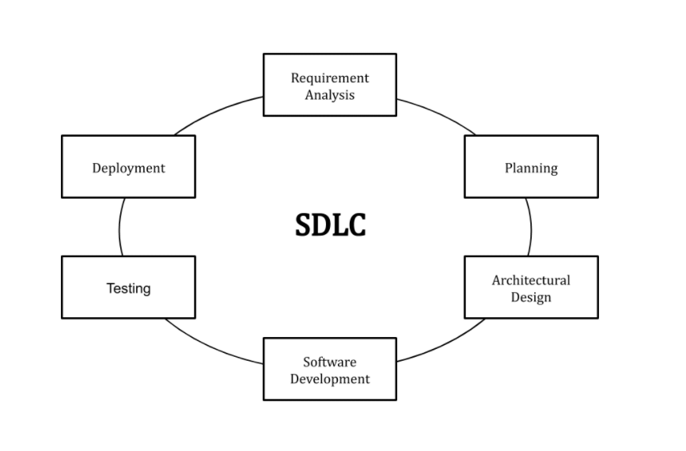

# Programming Practices

For each of the empty headings below, fill in the detail.

## Software Quality

Software quality is not the measure of _what_ the program does, rather, it is the measure of _how well_ it does it. Indeed, it's important to consider _how well_ at every stage.

### Maintainability

Software maintainability is defined as the degree to which an application is _understood_, _repaired_, or _enhanced_. It is the ability of the system to _support changes_.
Finding ways to measure this important factor eases developer effort, decreases costs, and frees up resources. Understanding software maintainability allows organizations to identify improvement areas as well as determine the value supplied by current applications or during development changes.

### Dependability

In systems engineering, dependability is a measure of a system's _availability_, _reliability_, _maintainability_, and in some cases, other characteristics such as _durability_, _safety_ and _security_. It reflects the user's degree of _trust_ in that system and the extent of the user's confidence that it will operate as users expect and that it will not 'fail' in normal use.
In real-time computing, dependability is the ability to provide services that can be trusted within a time-period.

### Efficiency

Is the amount of software developed or requirement divided by the number of resources used like time, effort, among other examples. Every system you employ should focus on having the _best efficiency_ and _productivity_ standards while enhancing _profitability_.

### Usability

Usability refers to the quality of a user's experience when interacting with products or systems, including websites, software, devices, or applications. Usability is about effectiveness, efficiency and the overall _satisfaction_ of the user.

## Planning

Planning is the thing you should do both _before_ you start building your application, and while you're doing it. In general, some thought _beforehand_ will lead to much better outcomes both _during_ and _after_.

### Software Development Lifecycles

SDLC or the Software Development Life Cycle is a process that produces software with the _highest quality_ and _lowest cost_ in the _shortest time_ possible. SDLC provides a well-structured flow of phases that help an organization to quickly produce high-quality software which is well-tested and ready for production use.

### Requirements Engineering

Requirements engineering is the process of _defining_, _documenting_, and _maintaining_ requirements in the engineering design process. It is a process of gathering and defining service provided by the system.

Consists of the following main activities:

1. Requirements elicitation: 
    Ways used to _gain knowledge_ about the project domain and requirements. The various sources of domain knowledge include customers, business manuals, the existing software of same type, standards and other stakeholders of the project.
    It does not produce formal models of the requirements understood.

2. Requirements specification:
    _Produce formal software_ requirement models. All the requirements including the functional as well as the non-functional requirements and the constraints are specified by these models in totality. More knowledge about the problem may be required which can again trigger the elicitation process.
    Models used at this stage include ER diagrams, data flow diagrams(DFDs), function decomposition diagrams(FDDs), data dictionaries, etc.

3. Requirements verification and validation:
    _Verification_ refers to the set of tasks that ensures that the software correctly implements a specific function. _Validation_ refers to a different set of tasks that ensures that the software that has been built is traceable to customer requirements.
    If requirements are not validated, errors in the requirement definitions would propagate to the successive stages resulting in a lot of modification and rework.

4. Requirements management:
    Process of _analyzing_, _documenting_, _tracking_, _prioritizing_ and _agreeing_ on the requirement and controlling the communication to relevant stakeholders. This stage takes care of the changing nature of requirements. It should be ensured that the SRS is as modifiable as possible so as to incorporate changes in requirements specified by the end users at later stages too. Being able to modify the software as per requirements in a systematic and controlled manner is an extremely important part of the requirements engineering process.

### Software Architecture

Software architecture is, simply, the _organization_ of a system and the _discipline_ of creating such structures and systems. The organization includes all components, how they interact with each other, the environment in which they operate, and the principles used to design the software. In many cases, it can also include the evolution of the software into the future.

### Software Design

Software design is the process by which an agent creates a specification of a software artifact intended to accomplish goals, using a set of primitive components and subject to constraints.

## Coding Standards

This section asks you to consider establishing consistent programming standards before you begin programming; hence, this is a bit like _planning_, too. In summary:

1. Know what the code must do
2. Maintain uniform naming (and layout) conventions throughout
3. Comment where necessary
4. Keep your code simple
5. Design your code! When building your apps, consider things like scalability and reuse

### Commenting and Documentation

Documentation is intended to help a user of your software _understand_ how to achieve their goals. That user may be an end user looking at a GUI, or a programmer using an API. Comments are intended to help you or someone else who is maintaining the code understand the code.

### Folder and File Organisation

File Organization refers to the logical relationships among various records that constitute the file, particularly with respect to the means of identification and access to any specific record. In simple terms, Storing the files in certain order is called file Organization.

Organize your data and code
1. Encapsulate everything within one directory.
2. Separate raw data from derived data.
3. Separate the data from the code.
4. Use relative paths (never absolute paths).
5. Choose file names carefully.
6. Avoid using “final” in a file name.
7. Write ReadMe files.

### Naming Conventions

A naming convention is a set of _rules_ for choosing the character sequence to be used for identifiers which denote variables, types, functions, and other entities in source code and documentation.
Naming things consistently, logically and in a predictable way will distinguish similar things from one another at a glance, and by doing so will facilitate the storage and retrieval of such things, which will enable users to browse more effectively and efficiently.

Some variable naming conventions include _Snakecase_, _Pascalcase_, _Camelcase_.

### KISS

KISS, an acronym for _keep it simple, stupid_. The KISS principle states that most systems work best if they are kept simple (less effort or complexity) rather than made complicated. Simplicity should be a key goal, and unnecessary complexity should be avoided.

### DRY

_"Don't repeat yourself"_ is a principle of software development aimed at _reducing_ repetition of software patterns, replacing it with abstractions or using data normalization to _avoid_ redundancy.

### Open/Closed

In object-oriented programming, the open–closed principle states software entities (classes, modules, functions, etc.) should be open for _extension_, but closed for _modification_, i.e, such an entity can allow its behaviour to be extended without modifying its source code.

### Scalability

Scalability is the measure of a system's ability to increase or decrease in performance and cost in response to changes in application and system processing demands. Prioritizing it from the start leads to lower maintenance costs, better user experience, and higher agility.

### Reusability

Reusability refers to the _quality_ of a software component that is sufficiently general that it is independent of the current programming problem. Since it is _independent_ it could in principle be used in a different program as well. But independence is not sufficient in order for a component to be reusable.
It must be sufficiently _easy_ to understand how to use the component so that writing a new one from scratch is simply not worthwhile. The component should have a _very_ specific purpose.

## Development

This section is all about the good habits we establish _while_ writing code - it's important to have some processes in place.

### Testing

Testing is the process of _executing_ a program with the aim of _finding errors_. To make our software perform well it should be error-free. If testing is done successfully it will remove all the errors from the software.

Types of Testing: 

1. Unit Testing: 
    Focuses on the _smallest unit_ of software design.

2. Integration Testing:
    Take unit tested components and build a program structure that has been dictated by design. A _group of components_ is combined to produce output. 

3. Regression Testing:
    Makes sure that the _whole_ component works properly even after _adding_ components to the complete program. 

4. Smoke Testing:
    Make sure that software under testing is ready or stable for _further_ testing.

5. Alpha Testing:
    Type of validation and acceptance testing which is done _before_ the product is released to _customers_. It is typically done by QA people.

6. Beta Testing:
    Conducted at one or more customer sites by the end-user of the software. This version is released for a _limited_ number of users for testing in a _real-time_ environment.

7. System Testing:
    Tested such that it works fine for the different _operating systems_. It is covered under the black box testing technique. We just focus on the required input and output without focusing on internal working. There is _security testing_, _recovery testing_, _stress testing_, and _performance testing_.

8. Stress Testing:
    Give _unfavorable_ conditions to the system and check how they perform in those conditions.

9. Performance/Load Testing:
    Test the _run-time_ performance of software within the context of an _integrated_ system. It is used to test the _speed_ and _effectiveness_ of the program. We check the performance of the system in the given load.

10. Object-Oriented Testing:
    Combination of various testing techniques that help to _verify_ and _validate_ object-oriented software (Testing of Requirements, Design and Analysis of Testing, Testing of Code, Integration testing, System testing and User Testing).

### Do One Thing (Single Responsibility)

The error of many novice programmers is to write complex functions and classes that do a lot of things. According to the Single Responsibility Principle, a module, a class or a function has to _only_ do _one_ thing. In other words, they have to have only _one_ responsibility.

### Debugging

Debugging is the process of _detecting_ and _removing_ of existing and potential errors (also called _‘bugs’_) in a software code that can cause it to behave unexpectedly or crash. 
When various subsystems or modules are tightly coupled, debugging becomes harder as any change in one module may cause more bugs to appear in another. Sometimes it takes more time to debug a program than to code it.
Debugging tactics can involve _interactive_ debugging, _control flow analysis_, _unit testing_, _integration testing_, _log file analysis_, _monitoring_ at the application or system level, _memory dumps_, and _profiling_. Many programming languages and software development tools also offer programs to aid in debugging, known as debuggers.

### Refactoring

Code refactoring is defined as the process of _restructuring_ computer code _without_ changing or adding to its external behavior and functionality.
